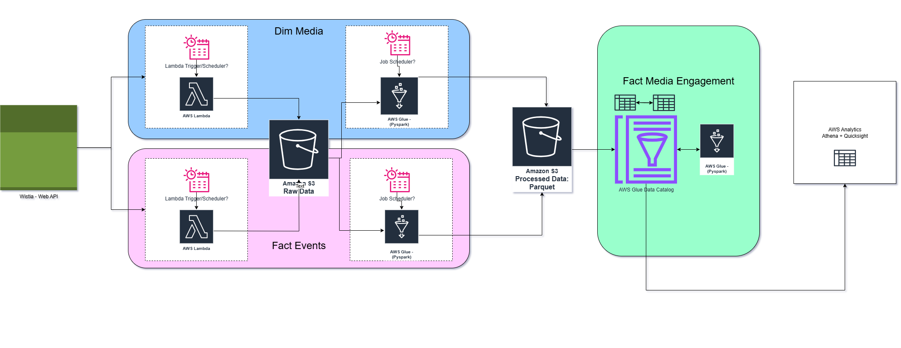
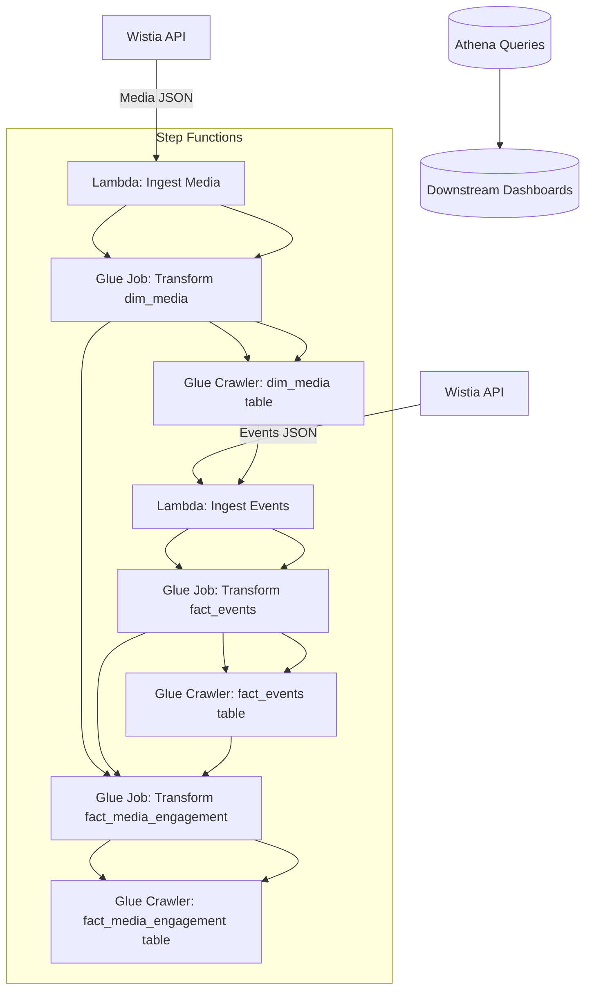

# Wistia Video Analytics Pipeline

This project implements an **end-to-end AWS-based pipeline** to ingest, transform, and store Wistia video analytics for reporting and downstream consumption.
The solution uses **AWS Lambda**, **AWS Glue**, **Amazon Athena**, and **AWS Step Functions** to orchestrate ingestion, transformations, and loading into a dimensional model.

## Infrastructure Set up (Micro Services and Service Enablement)

The pipeline is built using AWS-managed services for scalability, cost efficiency, and reduced operational overhead.

**Enabled and configured services:**

* **AWS Lambda** – Used for data ingestion from Wistia API (Media and Events).
* **AWS Glue Jobs** – Pyspark ETL for transforming raw JSON data into partitioned Parquet datasets.
* **AWS Glue Crawlers** – Automatic schema detection and table creation in AWS Glue Data Catalog.
* **Amazon S3** – Centralized storage for raw and processed datasets.
* **AWS Step Functions** – Orchestration of the full workflow from ingestion to transformation and catalog updates.
* **Amazon Athena** – Serverless SQL queries for processed datasets.

## Architecture Diagram




---
## Observations

* **Lambda cold start deployment issues** were resolved by:

  * Packaging dependencies in a `.zip` and uploading to S3 for Lambda layers.
  * Setting correct **IAM execution role permissions** for S3 read/write and Wistia API access.

* The **incremental events ingestion** Lambda now:

  * Pulls only events for the last 24 hours.
  * Skips S3 upload if there are **no new events**.
  * Maintains a `latest_event_file.json` pointer file to track the most recent uploaded file.

* **Glue ETL jobs** were modified to:

  * Read only the **latest file** from the raw S3 path.
  * Avoid creating empty partitions when no new data exists.

* **Step Functions** successfully orchestrate the pipeline:

  * Media ingestion → Media dimension transform → Events ingestion → Events fact transform → Media engagement fact transform.
  * Added **Glue Crawlers** after each transform job for schema refresh.

* We can now **run the pipeline once** manually and **schedule it** with EventBridge for recurring runs.

---

## Assumptions

* Wistia API token is stored securely in **AWS Lambda environment variables**.
* S3 bucket structure is consistent:

  ```
  raw_data/media/
  raw_data/events/
  processed/dim_media/
  processed/fact_events/
  processed/fact_media_engagement/
  ```

* Media and events are joined on a common `media_id` key for the engagement fact table.
* Athena tables are created by Glue Crawlers with correct schema inference from processed parquet files.
* The **list of media IDs** to pull events for is predefined and controlled via Lambda environment variables.

---

## Key Steps

1. **Ingest Media Metadata**

   * Lambda fetches all media records from Wistia API.
   * Uploads raw JSON to S3 under `raw_data/media/`.

2. **Transform dim\_media**

   * AWS Glue job flattens JSON, selects required fields, and writes parquet to `processed/dim_media/`.
   * Glue Crawler updates Athena table.

3. **Ingest Events Data**

   * Lambda fetches events for each target media ID for the last 24 hours.
   * Uploads to `raw_data/events/` only if events exist.
   * Updates `latest_event_file.json`.

4. **Transform fact\_events**

   * AWS Glue job reads **only the latest file** from `raw_data/events/`.
   * Writes parquet to `processed/fact_events/`.
   * Glue Crawler updates Athena table.

5. **Transform fact\_media\_engagement**

   * AWS Glue job joins `dim_media` and `fact_events`.
   * Calculates engagement metrics (e.g., total watch time, average % viewed).
   * Writes parquet to `processed/fact_media_engagement/`.
   * Glue Crawler updates Athena table.

6. **Pipeline Orchestration**

   * AWS Step Functions sequence:

     ```
     Ingest Media → Transform dim_media → Crawler
     → Ingest Events → Transform fact_events → Crawler
     → Transform fact_media_engagement → Crawler
     ```
   * Retry and failure handling per step.

---

## Downstream Consumption

* **Athena** provides a query interface for analysts to explore:

  * Media details
  * Event-level interactions
  * Engagement summaries

* Data is ready for visualization in:

  * **Amazon QuickSight**
  * BI tools like Tableau, Power BI

* Possible future integration into:

  * Marketing analytics dashboards
  * Automated performance alerts

## Possible Next Steps

* Parallelize the data ingestion and subsequent transformation for different API endpoints.
* Add **parameterized Step Functions input** to support ad-hoc date range runs.
* Implement **CloudWatch metrics** and alarms for ingestion failures.
* Optimize Glue jobs for cost by using **Pushdown predicates** and **DynamicFrames** selectively.
* Extend the pipeline for **Wistia audience analytics** and **geo-level insights**.


